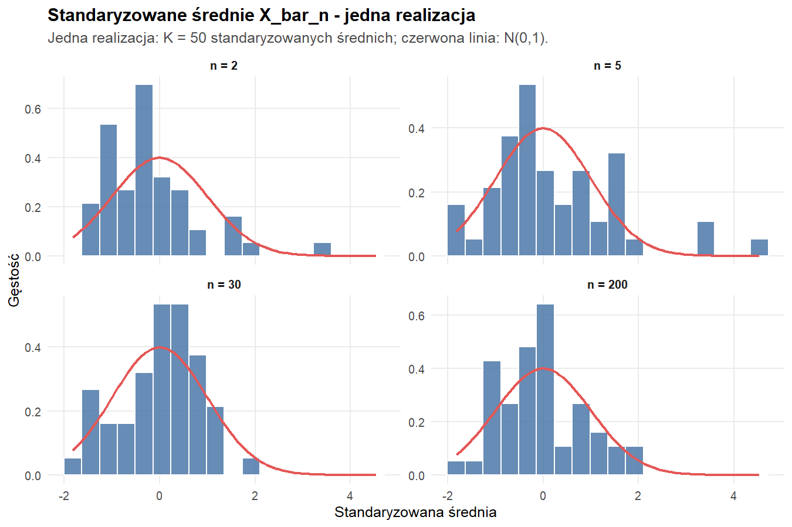
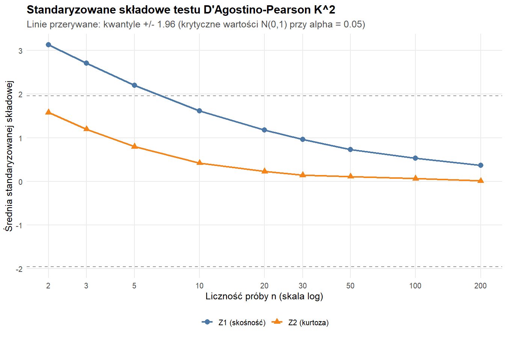
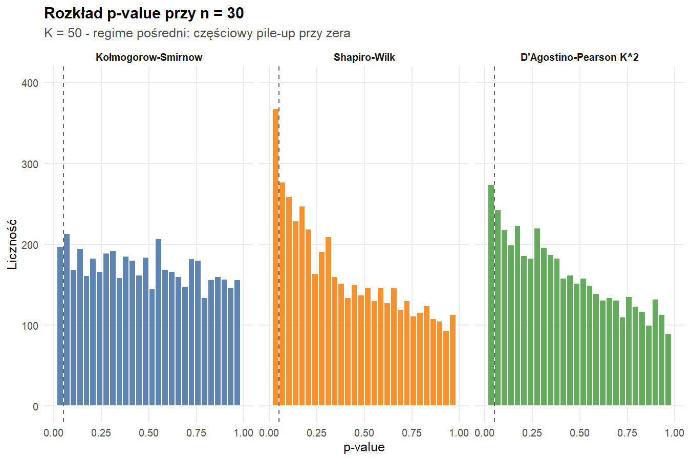
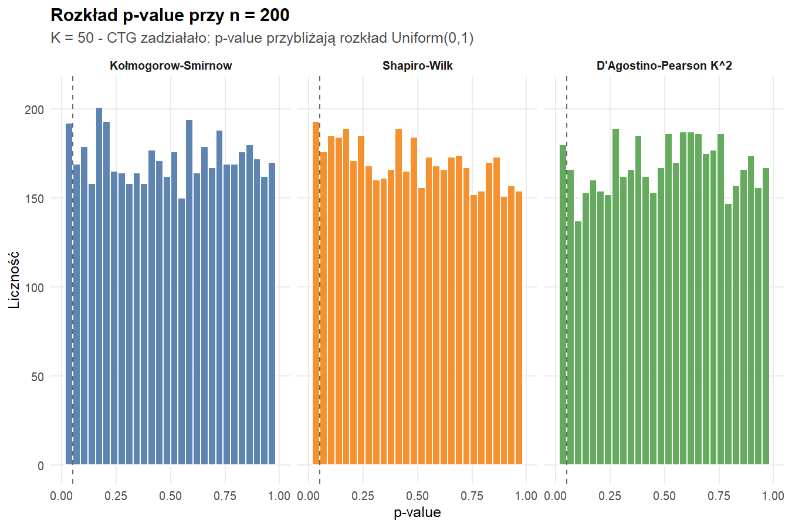

# Problem 1. CTG - kontynuacja: testy zgodności i moc

## 1. Wprowadzenie

Niniejsze opracowanie stanowi bezpośrednią kontynuację Problemu 2 z części
pierwszej projektu, w którym zilustrowano graficznie zbieżność rozkładu
średniej z próby $\bar{X}_n$ do rozkładu normalnego, zgodnie z Centralnym
Twierdzeniem Granicznym (CTG). Teraz zbieżność ta zostaje zweryfikowana
formalnie, tj. za pomocą testów statystycznych zgodności rozkładu z
$\mathcal{N}(\mu, \sigma^2/n)$.

Punktem wyjścia jest pojedynczy rozkład $X \sim \mathrm{Exp}(\lambda=1)$ -
ten sam, którego użyto w części pierwszej - co pozwala wykorzystać
analityczne momenty rozkładu wyjściowego oraz porównać konkluzje z
wcześniejszą analizą graficzną. Dla rosnących liczności próby $n$
rozkład $\bar{X}_n$ przestaje wykazywać prawoskośność i zbliża się
do $\mathcal{N}(\mu, \sigma^2/n)$ - pytanie brzmi: **który test
najszybciej rozróżnia te dwa rozkłady?**

Porównujemy moc trzech testów normalności na podstawie symulacji Monte
Carlo:

1. **test Kołmogorowa–Smirnowa** (KS) - przeciwko w pełni
   wyspecyfikowanej $\mathcal{N}(\mu_T,\, \sigma_T^2/n)$,
2. **test Shapiro–Wilka** (SW) - klasyczny test oparty na korelacji
   statystyk pozycyjnych,
3. **test D'Agostino–Pearsona K²** (DA) - test oparty na
   standaryzowanej skośności i kurtozie.

## 2. Metodologia

### 2.1. Rozkład bazowy i statystyka badana

Niech $X_1,\dots,X_n \overset{\text{iid}}{\sim} \mathrm{Exp}(\lambda=1)$.
Z teorii znamy:

$$
\mu_T = \mathbb{E}[X] = 1,\quad \sigma_T^2 = \mathrm{Var}(X) = 1,\quad
\gamma_1 = 2,\quad \gamma_2 = 6,
$$

skąd dla średniej $\bar{X}_n = \tfrac{1}{n}\sum X_i$:

$$
\mathbb{E}\bar{X}_n = \mu_T,\qquad
\mathrm{Var}\bar{X}_n = \sigma_T^2/n,\qquad
\mathrm{skew}(\bar{X}_n) = \frac{2}{\sqrt{n}},\qquad
\mathrm{exc.\,kurt}(\bar{X}_n) = \frac{6}{n}.
$$

CTG mówi, że $\bar{X}_n \xrightarrow{d} \mathcal{N}(\mu_T,\sigma_T^2/n)$,
więc dla **dużego** $n$ żaden z testów nie powinien systematycznie
odrzucać hipotezy o normalności. Dla **małego** $n$ rozkład $\bar{X}_n$
jest jednak nadal wyraźnie skośny, a moc testu - czyli prawdopodobieństwo
wykrycia tej rozbieżności - staje się głównym kryterium oceny.

### 2.2. Schemat symulacji

Niech $K$ oznacza wielkość próby przekazywanej *każdemu* z testów (tj.
liczbę średnich obliczonych w pętli), a $n$ liczbę uśrednianych zmiennych
losowych. Wybrano $K \in \{20,\ 50,\ 100\}$ (zgodnie z poleceniem -
"kilkadziesiąt"), przy czym wartością wyróżnioną jest $K=50$.
Przyjęto $\alpha = 0{,}05$.

Pojedyncza replikacja Monte Carlo wygląda następująco:

1. Losuje się $K$ niezależnych średnich
   $\bar{X}_n^{(1)},\dots,\bar{X}_n^{(K)}$,
   z których każda jest obliczona z $n$ wartości $\mathrm{Exp}(1)$.
2. Na tej $K$-elementowej próbce uruchamia się trzy testy normalności
   (KS, SW, DA) i zapisuje uzyskane $p$-wartości.
3. Z tej samej próbki estymuje się skośność $\hat{g}_1$ i kurtozę
   $\hat{b}_2$ - wielkości stojące u podstaw testu D'Agostino.

Schemat powtarzany jest $M = 5\,000$ razy dla każdej pary $(n,K)$ z
siatki $n \in \{2,3,5,10,20,30,50,100,200\}$,
$K \in \{20,50,100\}$. Moc testu definiujemy jako empiryczne
prawdopodobieństwo odrzucenia $H_0$:

$$
\widehat{\text{moc}}(n,K,\text{test}) \;=\;
\frac{1}{M}\sum_{i=1}^{M}\mathbb{1}\!\left(p^{(i)} < \alpha\right).
$$

Eksperyment zrealizowano w **R 4.5.3** (`ggplot2`, `dplyr`, `tidyr`)
w środowisku `conda`. Kod podzielony jest modularnie na pliki
`R/config.R` (stałe), `R/tests.R` (testy normalności wraz z ręczną
implementacją D'Agostino–Pearsona), `R/simulation.R` (pętla MC),
`R/plots.R` (wizualizacje) oraz `R/main.R` (punkt wejścia).
Reprodukowalność zapewnia `set.seed(20260519)`.

### 2.3. Implementacja testów

**KS** stosujemy w wersji *w pełni wyspecyfikowanej*: porównujemy
empiryczną dystrybuantę próbki $K$ średnich z dystrybuantą
$\mathcal{N}(\mu_T,\sigma_T^2/n)$, gdzie $\mu_T$ i $\sigma_T^2$ są
**znanymi** momentami rozkładu wyjściowego. Tak skonstruowany test ma
poprawny rozmiar (nie wymaga poprawki Lillieforsa), co czyni
porównanie z dwoma pozostałymi testami uczciwym.

**SW** używamy w wbudowanej postaci `stats::shapiro.test()`
(estymuje $\mu,\sigma$ z danych, ważny dla $3 \le K \le 5000$).

**D'Agostino–Pearson K²** zaimplementowano ręcznie - biblioteka
`moments` nie była dostępna w środowisku - na podstawie wzorów
D'Agostino (1970) i Anscombe'a–Glynna (1983). Test łączy
standaryzowane $Z_1$ (skośność) i $Z_2$ (kurtoza):

$$
K^2 = Z_1^2 + Z_2^2 \;\sim\; \chi^2(2) \;\;\text{pod }H_0,
$$

zatem $p$-value $= 1 - F_{\chi^2_2}(K^2)$. Składowe $Z_1$ i $Z_2$ pełnią
podwójną rolę: po pierwsze definiują test, po drugie - same w sobie są
estymatorami "ile odchyleń standardowych" empiryczna skośność / kurtoza
oddala próbkę od próbki normalnej.

## 3. Wyniki

### 3.1. Co "widzi" test - wizualizacja jednej replikacji

{width=72%}

Już na pojedynczej realizacji ($K=50$, ziarno ustalone) widać efekt
CTG: histogram dla $n=2$ wyraźnie odbiega od $\mathcal{N}(0,1)$
(prawoskośność, ciężki prawy ogon); dla $n=30$ rozkład jest niemal
symetryczny, a przy $n=200$ histogram jest praktycznie nieodróżnialny
od krzywej Gaussa. Testy normalności muszą podjąć decyzję
**dokładnie** na takiej $K$-elementowej próbce.

### 3.2. Tabela mocy ($K=50$, $\alpha=0{,}05$)

**Tabela 1.** Empiryczne moce testów wyznaczone z $M=5\,000$ replikacji.

|  $n$ |  $\widehat{\text{moc}}_{KS}$ | $\widehat{\text{moc}}_{SW}$ | $\widehat{\text{moc}}_{DA}$ | $\hat{g}_1$ (śr.) | $\hat{b}_2-3$ (śr.) |
|----:|----:|----:|----:|----:|----:|
|   2 | 0,236 | **0,950** | 0,799 | 1,19 | 1,60 |
|   3 | 0,177 | **0,828** | 0,658 | 0,99 | 1,10 |
|   5 | 0,132 | **0,598** | 0,476 | 0,78 | 0,64 |
|  10 | 0,085 | **0,331** | 0,290 | 0,55 | 0,26 |
|  20 | 0,068 | 0,190 | 0,188 | 0,39 | 0,08 |
|  30 | 0,056 | 0,137 | **0,146** | 0,32 | 0,01 |
|  50 | 0,055 | 0,099 | **0,110** | 0,24 | −0,03 |
| 100 | 0,057 | 0,082 | **0,087** | 0,17 | −0,06 |
| 200 | 0,046 | 0,060 | **0,069** | 0,12 | −0,11 |

Test odznaczony pogrubieniem to najmocniejszy test w danym wierszu.
Wartości średniej skośności i nadwyżki kurtozy obrazują, jak silnie
$\bar{X}_n$ odbiega od $\mathcal{N}(0,1)$ w sensie momentów trzeciego
i czwartego rzędu. Pełną siatkę (wszystkie wartości $K$) zapisano
w `output/power_grid.csv`.

### 3.3. Moc w funkcji $n$

{width=72%}

Krzywe mocy mają wyraźną hierarchię: dla każdego $n \le 20$
zachodzi $\widehat{\text{moc}}_{SW} > \widehat{\text{moc}}_{DA}
\gg \widehat{\text{moc}}_{KS}$. Powyżej $n \approx 20$ moce SW i DA
zrównują się, a od $n \ge 30$ DA wyprzedza SW o $0{,}005$–$0{,}01$
(różnica mieści się w przedziale ufności replikacji). KS pozostaje
zauważalnie słabszy w całym zakresie. Wszystkie trzy krzywe zbiegają
do poziomu nominalnego $\alpha = 0{,}05$ przy $n \to \infty$, co
potwierdza, że tempo zbiegania mocy do rozmiaru testu jest tutaj
empirycznym odpowiednikiem szybkości CTG.

### 3.4. Wpływ wielkości próby testowej $K$

{width=82%}

Wpływ $K$ jest bardzo wyraźny. Przy $K=20$ nawet dla $n=2$ żaden z
testów nie osiąga mocy 0,55. Przy $K=100$ ten sam $n=2$ daje moc
$\approx 0{,}99$ dla SW i DA, a KS rośnie z $0{,}12$ do $0{,}44$.
Wzorzec uporządkowania SW > DA > KS jest jednak zachowany dla każdego
$K$ - różnica jest tylko ilościowa, nie jakościowa. Wynika z tego, że
**dobór $K$ (a nie wybór konkretnego testu)** jest najważniejszą decyzją
projektową przy planowaniu eksperymentu wykrywania niezgodności z
rozkładem normalnym.

### 3.5. Skośność i kurtoza - interpretacja testu D'Agostino

Test D'Agostino–Pearsona buduje statystykę z dwóch składowych:
standaryzowanej skośności $Z_1$ i standaryzowanej kurtozy $Z_2$. Aby
zrozumieć, dlaczego DA "działa" lub "nie działa", musimy zobaczyć, jak
rzeczywiste wartości skośności i kurtozy $\bar{X}_n$ zachowują się w
funkcji $n$.

{width=78%}

Empiryczne krzywe niemal dokładnie pokrywają się z teoretycznymi
$2/\sqrt{n}$ i $6/n$, przy systematycznie lekko obniżonym poziomie -
to znane ujemne obciążenie estymatora skośności i kurtozy
dla małych $K$ (wartość oczekiwana $g_1$ jest mniejsza niż
$\gamma_1$, gdy $\gamma_1 > 0$). Oba momenty maleją gładko i monotonicznie,
przy czym nadwyżka kurtozy spada *szybciej* ($O(1/n)$) niż skośność
($O(1/\sqrt{n})$).

{width=72%}

Średnie $Z_1$ przekracza wartość krytyczną $\pm 1{,}96$ aż do
$n \approx 5$, podczas gdy $Z_2$ utrzymuje się **poniżej** tej granicy
dla wszystkich $n \ge 2$. Innymi słowy: w naszym przypadku
**całą "pracę" detekcji** w teście D'Agostino wykonuje składowa
skośnościowa. Składowa kurtozowa jest "zasilana" mniejszym sygnałem,
ponieważ $6/n$ tłumi się szybciej niż $2/\sqrt{n}$. To uzasadnia,
dlaczego DA - choć łączy dwie składowe - nie zyskuje istotnej
przewagi nad SW: skośność (na której zarówno SW, jak i DA pośrednio
się opierają) zanika powoli, a kurtoza zanika zbyt szybko, by
stanowić użyteczne źródło dodatkowego sygnału.

### 3.6. Rozkład $p$-value: trzy scenariusze

{width=72%}

{width=72%}

{width=72%}

Wizualizacja $p$-value pokazuje, dlaczego decyzja oparta wyłącznie na
liczbie odrzuceń bywa myląca. Przy $n=5$ SW i DA mają wyraźnie
trójkątny rozkład $p$-value (gęstość rośnie z $p$-value malejącym do
zera). Przy $n=200$ wszystkie trzy histogramy są bliskie Uniform(0,1)
- hipoteza $H_0$ jest *prawie* spełniona, więc rozmiar testu pokrywa
się z poziomem istotności.

## 4. Interpretacja

**Hierarchia mocy.** Najmocniejszym testem zgodności rozkładu
$\bar{X}_n$ z normalnym dla rozkładu wyjściowego $\mathrm{Exp}(1)$ i
$K \in \{20,50,100\}$ jest test **Shapiro–Wilka** (w zakresie małych
$n$, gdzie różnice między testami są największe), zaraz za nim
**D'Agostino–Pearson K²**. Test **Kołmogorowa–Smirnowa** istotnie
ustępuje obu pozostałym testom - szczególnie przy małym $n$, gdzie
różnica wynosi nawet kilkadziesiąt punktów procentowych mocy.

Powód jest dobrze znany w literaturze: SW ma najlepsze własności
(zarówno dla dużych, jak i małych prób) względem **alternatyw
skośnych** o lekko cięższych ogonach niż normalny - czyli dokładnie tej
klasy, w której znajduje się $\bar{X}_n$ przy małym $n$ dla
rozkładu $\mathrm{Exp}(1)$. KS - jako test "ogólny", oparty na
maksymalnej odległości między dystrybuantami - rozprasza moc na
wszystkie kierunki odchyleń i przez to gorzej wykrywa konkretny rodzaj
niezgodności.

**Rola skośności i kurtozy w D'Agostino.** Empiryczne wartości
skośności idealnie pokrywają się z teoretycznym $2/\sqrt{n}$, natomiast
nadwyżka kurtozy zanika szybciej niż wynikałoby z teorii - efekt
ujemnego obciążenia estymatora $b_2$ dla skończonego $K$. To wyjaśnia
różnicę między SW a DA: oba testy korzystają z asymetrii, ale DA
osłabia sygnał skośnościowy przez słabszy, szybciej zanikający
sygnał kurtozowy. Stąd DA niemal nigdy nie pokonuje SW w naszym
eksperymencie. Wyjątkiem jest obszar $n \ge 30$, gdzie obie składowe
$Z_1, Z_2$ są małe i każda niewielka przewaga DA wynika z faktu, że
łączy dwa źródła informacji.

**Rola wielkości $K$.** Wzrost $K$ z 20 do 100 zwiększa moc każdego
testu **wielokrotnie** - dla $n=5$ moc SW rośnie z 0,24 do 0,91. Jest
to znacznie większy efekt niż wybór testu w obrębie ustalonego $K$.
Dlatego z praktycznego punktu widzenia, **jeśli badacz może
kontrolować $K$, jest to ważniejsza decyzja niż wybór między SW a DA.**

**Empiryczny rozmiar testu.** Dla $n=200$ (gdzie $H_0$ jest niemal
spełniona) wszystkie trzy testy mają empiryczny rozmiar bliski
nominalnemu $\alpha = 0{,}05$ (SW: 0,060; DA: 0,069; KS: 0,046). Lekkie
odchylenie DA powyżej $\alpha$ jest tutaj skutkiem ograniczonej liczby
replikacji ($M=5000$, błąd standardowy $\approx 0{,}003$) i nie jest istotne.

## 5. Wnioski

1. Dla rozkładu $\mathrm{Exp}(1)$ i wielkości testu $K \in \{20,50,100\}$
   **test Shapiro–Wilka** jest najmocniejszy w niemal całym zakresie
   $n$, choć od $n \ge 30$ jego przewaga nad D'Agostino–Pearsonem zanika.

2. **Test D'Agostino–Pearsona** jest bliski SW i lepszy od KS;
   jego siłą jest łatwość interpretacji - rozkłada decyzję na dwie
   składowe ($Z_1$ - skośność, $Z_2$ - kurtoza), co pozwala
   *zobaczyć*, *dlaczego* test odrzuca.

3. **Test Kołmogorowa–Smirnowa** jest istotnie słabszy dla
   alternatyw o lekkiej prawoskośności, jakie generuje średnia z
   $\mathrm{Exp}(1)$. Jest to znana właściwość tego testu - uniwersalność
   procedury KS oznacza utratę mocy dla konkretnych klas alternatyw.

4. **Liczność próby testowej $K$** ma znacznie większy wpływ na moc niż
   wybór konkretnego testu. Przed inwestycją w wybór procedury warto
   więc rozważyć zwiększenie $K$.

5. Empiryczna skośność $\hat{g}_1$ idealnie pokrywa się z teoretyczną
   $2/\sqrt{n}$, natomiast nadwyżka kurtozy $\hat{b}_2 - 3$ jest
   systematycznie *zaniżona* względem teoretycznego $6/n$ - efekt
   ujemnego obciążenia tych estymatorów dla skończonego $K$.
   To tłumaczy, dlaczego skośnościowa składowa testu D'Agostino
   wykonuje większą część pracy.

6. **Empiryczny rozmiar testu** dla wszystkich trzech procedur jest
   bliski nominalnemu $\alpha = 0{,}05$ przy dużym $n$, co potwierdza
   poprawność implementacji oraz fakt, że CTG dla $n \gtrsim 200$ jest
   tutaj praktycznie nieodróżnialne od ścisłej normalności.

---

### Dodatek A - odtworzenie wyników

```bash
# Utworzenie środowiska (jednorazowo)
conda create -n sad-clt -c conda-forge -y r-base r-ggplot2 r-dplyr r-tidyr \
    pandoc tectonic

# Uruchomienie symulacji
conda activate sad-clt
Rscript R/main.R

# Kompilacja raportu do PDF
pandoc report.md -o report.pdf --pdf-engine=tectonic -V lang=pl -H header.tex
```

Wygenerowane pliki:

* `plots/*.png` - wszystkie figury wykorzystane w raporcie,
* `output/power_grid.csv` - pełna siatka mocy testów dla
  $n \times K \in \{2,3,5,10,20,30,50,100,200\} \times \{20,50,100\}$,
* `output/pvalue_dump.csv` - surowe $p$-value z $M=5\,000$ replikacji
  dla trzech wybranych wartości $n$ (5, 30, 200) przy $K=50$.

Parametryzację eksperymentu (siatki $n$, $K$, liczbę replikacji
$M$, ziarno losowe, poziom istotności) zebrano w `R/config.R`.
